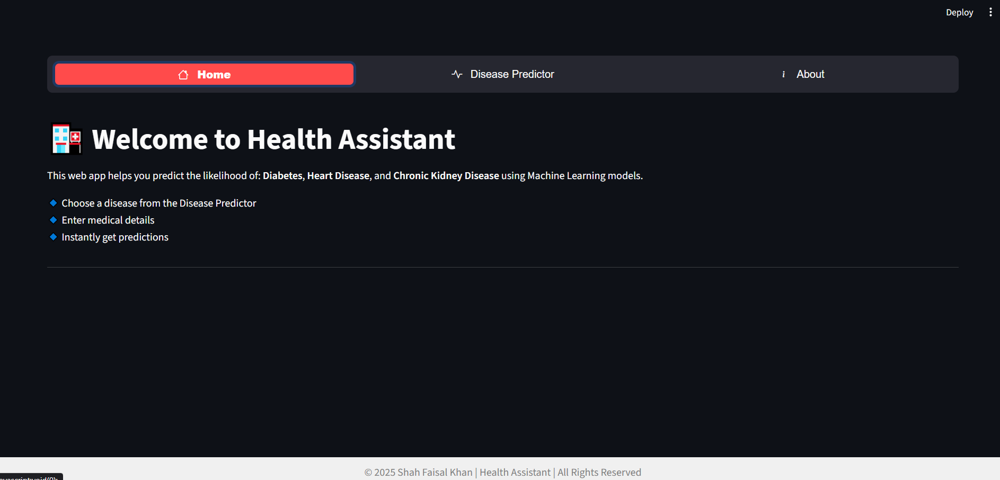
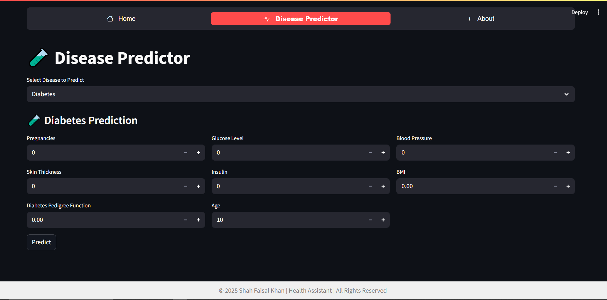

# 🏥 Multiple Disease Prediction Web App

A Machine Learning-powered web application that predicts the likelihood of Diabetes, Heart Disease, and Chronic Kidney Disease (CKD) based on user inputs. The app is built with Python, Machine Learning models, and Streamlit for easy interaction.

## 🚀 Overview

- Built a predictive system using Logistic Regression and Random Forest Classifier.
- Provides early detection insights for three critical diseases.
- Interactive Streamlit web app for user-friendly predictions.
- Aimed at helping users and medical practitioners with preliminary analysis.

## 📂 Project Structure
```
disease-prediction-app/
│-- Dataset/                # CSV datasets for Diabetes, Heart Disease, CKD
      |-- Chronic Kidney.csv
      |-- diabetes.csv
      |-- heart.csv

│-- Notebooks/              # jupyter notebooks  
      |-- ckd_prediction.ipynb
      |-- Diabetes_prediction.ipynb
      |-- Heart_prediction.ipynb

│-- Saved Models/           # Trained ML models (pickle files)
      |-- CKD_model.sav
      |-- Ckd_scalar.sav
      |-- Diabetes_model.sav
      |-- Heart_model.sav
|-- Images
      |-- logo.png
      |-- pic.png
      |-- pic2.png     
│-- webapp.py               # Streamlit app script
│-- requirements.txt        # Dependencies
│-- README.md               # Documentation
```

## ⚙️ Installation

Clone the repository and install dependencies:

**Clone repo**
```
git clone https://github.com/username/disease-prediction-app.git  
```

**Navigate**
```
cd disease-prediction-app  
```

**Install dependencies**
```
pip install -r requirements.txt  
```

**Run app**
```
streamlit run app.py
```

## 🖥️ Usage

- Select a disease type from the sidebar.
- Enter patient health details in the input form.
- Click Predict to view the disease prediction result.

**Example command:**
```
streamlit run app.py
```

 [Click here to run it live server](https://disease-prediction-webapp-ml-mrrvskgvwisilmzjtflpmz.streamlit.app/)
 

## 📊 Features

- Predicts Diabetes likelihood
- Predicts Heart Disease likelihood
- Predicts Chronic Kidney Disease (CKD) likelihood
- Interactive user interface via Streamlit
- Supports multiple ML models

## 📸 Screenshots

Screenshot of the web app

 



## 🛠️ Tech Stack

- Python (Pandas, NumPy, Scikit-learn)
- Machine Learning Models: Logistic Regression, Random Forest
- Streamlit for web app
- Matplotlib / Seaborn for visualizations

## 📈 Results

- Achieved good prediction accuracy across all three diseases.
- Demonstrated effective early diagnosis support.

### 🧑‍💻 Author

**Shah Faisal Khan**

- 📧 Email: shahfaisal3102@gmail.com 
- 🔗 [LinkedIn](www.linkedin.com/in/shah-faisal-khan-882965235)

